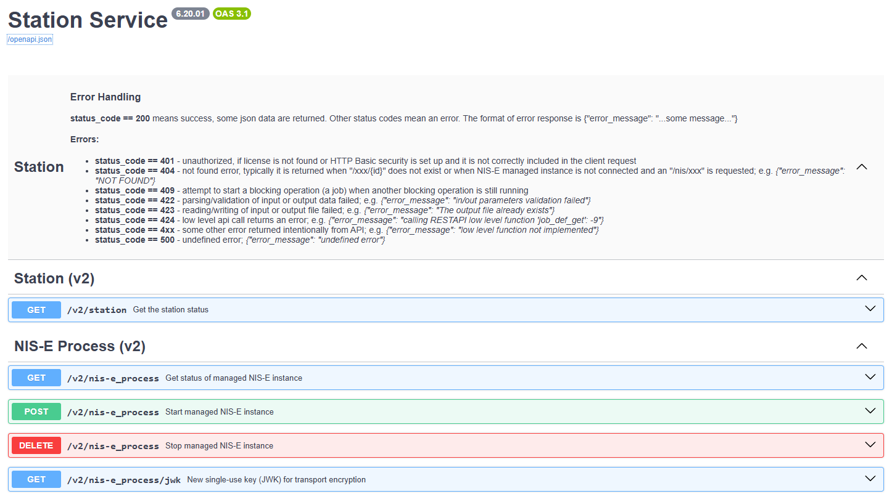

# Scheduler API
The Scheduler API provides tools for running and managing automated NIS-Elements tasks (JOBs, GA3) using the HTTP protocol. The first release was in NIS-Elements version 6.20.00.

---
- [Scheduler API](#scheduler-api)
- [Automatically generated documentation](#automatically-generated-documentation)
- [How to install and setup](#how-to-install-and-setup)
- [Examples](#examples)
- [Advanced Configuration](#advanced-configuration)
---

# Automatically generated documentation

[https://laboratory-imaging.github.io/scheduler-api](https://laboratory-imaging.github.io/scheduler-api)

_Generated by [Swagger UI](https://swagger.io/docs/)_

> [!CAUTION]  
> Only for V1 users: [Scheduler API - Docs (V1 enabled)](https://laboratory-imaging.github.io/scheduler-apil?url=openapi_v1enabled.json)

# How to install and setup

# Examples

# Advanced Configuration
